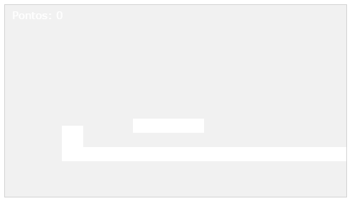

# MicroGameEngine
Engine Simples de Jogos 2D com poucos recursos, para quem quer entender a mecânica por tras da programação de jogos 2D.

<h2>Conceito</h2>

Criação de uma área na pagina HTML com duas plataformas e um jogador. Onde é possível pular entre as plataformas e acumular pontuação.
O código engine.js é auto descritivo, o que torna o entendimento muito fácil.
